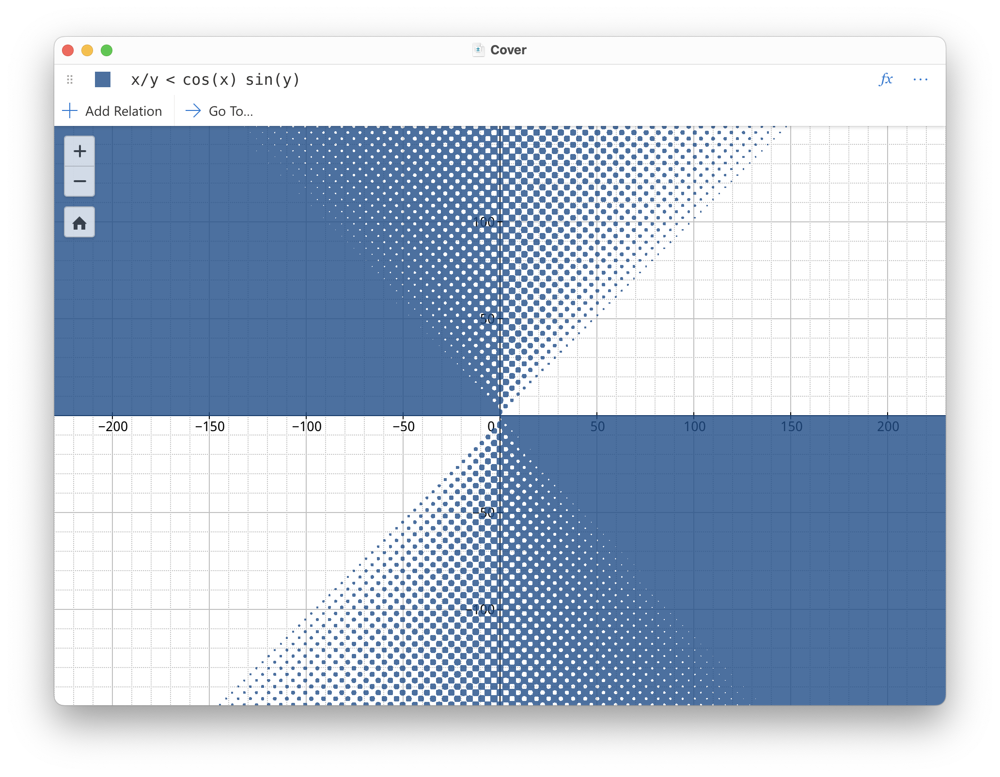

# Graphest

[](https://github.com/unageek/graphest/actions?query=branch%3Amaster+workflow%3Abuild)

<p align="center">
  
</p>

Graphest is a graphing calculator that can faithfully plot arbitrary mathematical relations of _x_ and _y_.

## Getting Started

A prebuilt version of the app for Macs with Apple silicon is available on the [releases](https://github.com/unageek/graphest/releases) page.

## Build from Source

### Prerequisites

#### macOS

1. Command Line Tools for Xcode

   ```bash
   xcode-select --install
   ```

1. [Rust](https://rustup.rs)

1. [Homebrew](https://brew.sh)

1. Node.js and npm

   ```bash
   brew install node
   ```

#### Windows

1. [Ubuntu on WSL](https://www.microsoft.com/store/productId/9NBLGGH4MSV6)

1. Either:

   - A X11 server such as [VcXsrv](https://sourceforge.net/projects/vcxsrv/) or [Xming](https://sourceforge.net/projects/xming/)
   - [WSLg](https://github.com/microsoft/wslg#installing-wslg)

1. Everything listed in [Ubuntu](#ubuntu) section, installed on WSL

#### Ubuntu

1. Command line tools and libraries

   ```bash
   sudo apt update
   sudo apt upgrade -y
   sudo apt install -y build-essential curl git libclang-dev m4 nodejs npm
   ```

   [libraries required to run Electron](https://github.com/electron/electron/issues/26673):

   ```bash
   sudo apt install -y libatk-bridge2.0-0 libatk1.0-0 libgbm1 libgconf-2-4 libgdk-pixbuf2.0-0 libgtk-3-0 libnss3
   ```

1. [Rust](https://rustup.rs)

### Build

1. Clone the repo and install Node.js dependencies

   ```bash
   git clone https://github.com/unageek/graphest.git
   cd graphest
   npm install
   ```

1. Debug the app

   ```bash
   npm start
   ```

## Algorithm

Graphest aims to provide a modern, open-source and extensible alternative to [GrafEq™](http://www.peda.com/grafeq/) program [Ped].

The following algorithms in [Tup01] are implemented: 1.1–3.2, 3.3 (partially), 3.4.1–3.4.3.

- [Ped] Pedagoguery Software Inc. GrafEq™. http://www.peda.com/grafeq
- [Tup96] Jeffrey Allen Tupper. _Graphing Equations with Generalized Interval Arithmetic._ Master's thesis, University of Toronto, 1996. http://www.dgp.toronto.edu/~mooncake/thesis.pdf
- [Tup01] Jeff Tupper. _Reliable Two-Dimensional Graphing Methods for Mathematical Formulae with Two Free Variables._ SIGGRAPH 2001 Conference Proceedings, 2001. http://www.dgp.toronto.edu/~mooncake/papers/SIGGRAPH2001_Tupper.pdf
